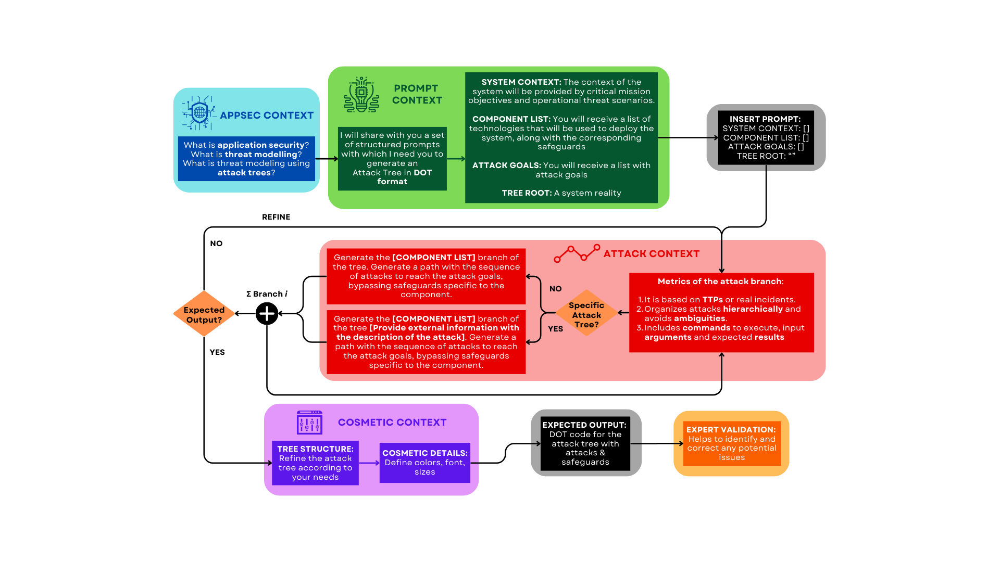

# Anticipating Adversary Behavior in DevSecOps Scenarios through Large Language Models

## Project Overview
This repository contains experimental materials and attack tree generation framework for analyzing adversary behavior patterns in DevSecOps pipelines using Large Language Models (LLMs). The work supports findings presented in our paper "Anticipating Adversary Behavior in DevSecOps Scenarios through Large Language Models" .

## Repository Structure
``` text
📁 Attack_Tree_Generation/
   📄 Prompts.txt          # Prompts used for attack tree generation
   🖼️ Flow_Diagram.png     # Workflow for attack tree construction
   📑 AttackProcedures.pdf # Attack procedures provided to LLMs
   📑 qwq.pdf              # Attack tree generated by QWQ_32B
   📑 gpt4.pdf             # Attack tree generated by GPT-4

📁 SCE_Experiment/
   📄 README.md            # Step-by-step replication guide
   📁 ...                  # Experiment-specific files
```

## Key Components

### Attack Tree Generation Framework
**Prompt Design** (`Attack_Tree_Generation/Prompts.txt`)  
Contains curated prompts used to guide LLMs in generating attack trees, following the methodology outlined in our paper.

**Methodology Workflow**  


**Generated Artifacts**  
- `qwq.pdf`: Attack tree diagram produced by QWQ_32B  
- `gpt4.pdf`: Additional attack tree from GPT-4  
- `AttackProcedures.pdf`: Technical specifications of analyzed attack vectors

## Experimental Validation
**SCE Experiment** (`SCE_Experiment/`)  
Contains complete materials to reproduce our security scenario evaluation with ChaosXploit framework:

### Overview 

The purpose of this experiment is to evaluate the resilience of an AWS environment to potential misuse of permissions. Specifically, the experiment will test whether an attacker can successfully request a Spot Instance, attach a privileged IAM role, and execute a reverse shell script to steal the IAM role credentials,using the permissions ec2:RequestSpotInstances and iam:PassRole.

### Quick Start

1. Navigate to the Runner folder and execute the installation script:
```bash
cd SCE_Experiment/Runner
./run.sh SCE_Experiment.json
```

### Making Changes

To modify the experiment behavior, edit these files:

- `actions.py`: Contains the actions to be executed during the experiment
- `probes.py`: Contains the probes used to verify system state

### Prerequisites

- Python 3.x
- Valid AWS Account with proper attacker permissions configured

### Note

The script will automatically:
- Create a virtual environment if it doesn't exist
- Install required dependencies
- Copy the modified files to the appropriate module location

## Contact  
For technical questions: [mario.m.c@um.es](mailto:mario.m.c@um.es)

