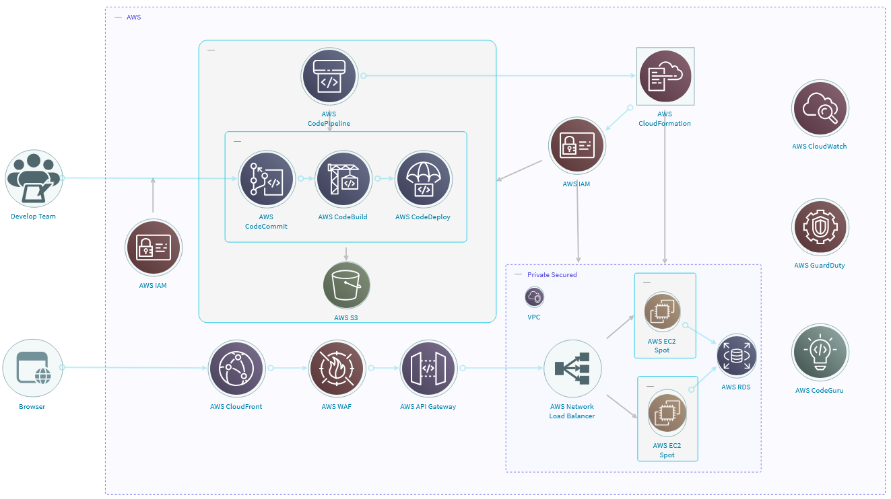

# Anticipating Adversary Behavior in DevSecOps Scenarios through Large Language Models

## Project Overview
This repository contains experimental materials and attack tree generation framework for analyzing adversary behavior patterns in DevSecOps pipelines using Large Language Models (LLMs). The work supports findings presented in our paper "Anticipating Adversary Behavior in DevSecOps Scenarios through Large Language Models" .

## Repository Structure
``` text
📁 Attack_Tree_Generation/
   📄 Prompts.txt          # Prompts used for attack tree generation
   🖼️ Flow_Diagram.png     # Workflow for attack tree construction
   📑 AttackProcedures.pdf # Attack procedures provided to LLMs
   📑 qwq.pdf              # Attack tree generated by QWQ_32B
   📑 gpt4.pdf             # Attack tree generated by GPT-4

📁 SCE_Experiment/
   📁 ...                  # Experiment-specific files
```

## Key Components

### LLMs generation settings and key configuration details 
| Feature / Parameter         	| QwQ-32B (Official)                                                                       	| GPT-4 (Official)                                                                               	|
|-----------------------------	|------------------------------------------------------------------------------------------	|------------------------------------------------------------------------------------------------	|
| Model Size                  	| 32 billion parameters                                                                    	| Not publicly specified (known to be large, but exact size undisclosed)                         	|
| Context Window              	| Up to 131,072 tokens (131k), with YaRN extension for >8,192 tokens                       	| 8,192 tokens maximum                                                                           	|
| Max New Tokens (Generation) 	| Up to 32,768 tokens                                                                      	| Up to 8,192 tokens                                                                             	|
| Temperature                 	| Default around 0.6 (balances creativity and precision)                                   	| Not explicitly disclosed publicly                                                              	|
| Top-P (Nucleus Sampling)    	| 0.95 (filters tokens to top 95% cumulative probability)                                  	| Not explicitly disclosed publicly                                                              	|
| Top-K                       	| Recommended between 20-40 (pre-selects probable tokens for diversity control)            	| Not explicitly disclosed publicly                                                              	|
| Presence Penalty            	| Between 0 and 2 to reduce repetition; higher values may cause occasional language mixing 	| Not explicitly disclosed publicly                                                              	|
| Sampling Method             	| Uses nucleus sampling (Top-P) with Min-P=0 to filter low-probability tokens              	| Not publicly detailed                                                                          	|
| Checkpoint Versions         	| QwQ-32B                                                                                  	| gpt-4-0613 snapshot                                                                            	|
| Training Cutoff Date        	| Not explicitly stated                                                                    	| December 2023                                                                                  	|
| Model Access                	| https://chat.qwen.ai                                                                     	| https://chatgpt.com                                                                            	|
| Special Features            	| YaRN extension for very long context, chain-of-thought and self-reflection capabilities  	| Supports streaming, fine-tuning via API, but no native long-context extension beyond 8K tokens 	|
| Use Case Focus              	| Complex reasoning, long context tasks, open customization                                	| General-purpose, managed service with strong multi-task performance                            	|

### Attack Tree Generation Framework
**Prompt Design** (`Attack_Tree_Generation/Prompts.txt`)  
Contains curated prompts used to guide LLMs in generating attack trees, following the methodology outlined in our paper.

|             **Step**            	|                                                                                                                                                                                                                                                                                                                                                                                             **Input to the LLM**                                                                                                                                                                                                                                                                                                                                                                                            	|
|:-------------------------------:	|:-----------------------------------------------------------------------------------------------------------------------------------------------------------------------------------------------------------------------------------------------------------------------------------------------------------------------------------------------------------------------------------------------------------------------------------------------------------------------------------------------------------------------------------------------------------------------------------------------------------------------------------------------------------------------------------------------------------------------------------------------------------------------------------------------------------:	|
| 1. Application security context 	|                                                                                                                                                                                                                                                                                                                                         _[New prompt]_ What is application security?, What is threat modeling?, What is threat modeling using attack-defense trees?                                                                                                                                                                                                                                                                                                                                         	|
|        2. Prompt context        	|                                                                                                                                                                                                                                                                                       _[New prompt]_ I will share with you a set of structured prompts with which I need you to generate an attack-defense tree in .DOT format composed of 3 branches with a root node, a set of attack nodes and an attack goal node                                                                                                                                                                                                                                                                                       	|
|     3. Inserting the context    	|                                                                                                           _[New prompt]_ **SYSTEM CONTEXT**: A secure cloud-native system, following a DevSecOps methodology for a military logistics branch to efficiently track and manage essential warfighter supplies (e.g., ammunition, medical kits, rations) across global bases, ensuring system functionality even in adverse cyberattack conditions. Regarding Operational Threat Scenarios, take into account adversary infiltration techniques and nation-state cyber espionage targeting military logistics systems. Emphasize advanced persistent threats (APTs) and privilege escalation attempts.                                                                                                          	|
|                                 	|                                                                                                                                                                                                                                                                   _[New prompt]_ **COMPONENT LIST**: “AWS EC2 (monitored by Amazon GuardDuty to detect anomalous accesses)”, “AWS CodeBuild (protected through continuous scanning by Amazon GuardDuty)”, “AWS CodeGuru (AI-powered code security analysis protecting AWS CodePipeline)".                                                                                                                                                                                                                                                                   	|
|                                 	|                                                                                                                                                                                                                                                                                                                                                                         _[New prompt]_ **ATTACK GOAL**: Privilege Escalation Attack                                                                                                                                                                                                                                                                                                                                                                         	|
|                                 	|                                                                                                                                                                                                                                                                                                                                                                        _[New prompt]_ **TREE ROOT**: Cloud-based supply chain system                                                                                                                                                                                                                                                                                                                                                                        	|
|        4. Attack Context        	|                                                                                                                                                                                                                                                _[New prompt]_ Requirements for each attack branch: <br>1. The attack nodes must be based on TTPs or real incidents.<br>2. Attack nodes must be ordered (Root Node -> Attack Node(s) -> Final Attack Goal Node).<br>3. Each attack node must include commands to execute, input arguments and expected results                                                                                                                                                                                                                                               	|
|                                 	| _[New prompt]_ Generate the [COMPONENT LIST] (e.g: “AWS EC2 (monitored by Amazon GuardDuty to detect anomalous accesses)”) branch of the tree, considering the attack documented in the next attached file. Create a path with the sequence of attacks to reach the attack goals, bypassing safeguards specific to the component.<br>_[EC2 Branch Attack Reference: https://cloud.hacktricks.wiki/en/pentesting-cloud/aws-security/aws-privilege-escalation/aws-ec2-privesc.html?highlight=ec2#ec2requestspotinstancesiampassrole ]_<br>_[CodeBuild Branch Attack Reference: https://cloud.hacktricks.wiki/en/pentesting-cloud/aws-security/aws-privilege-escalation/aws-codebuild-privesc.html?highlight=codebuild#iampassrole-codebuildcreateproject-codebuildstartbuild--codebuildstartbuildbatch ]_ 	|
|                                 	|                                                                                                                                                                                                                                                                                                               _[New prompt]_ (Optional in case the LLM does not format the branch properly) Concatenate the attacks vertically demonstrating the sequence of attacks to reach the attack goal                                                                                                                                                                                                                                                                                                               	|
|       5. Cosmetic Context       	|                           _[New prompt]_ Now you will receive an attack-defense tree in .DOT format. Apply the following cosmetic changes:<br>1. Use Arial as the font<br>2. Use #ACCFF2 and black letters for attack nodes.<br>3. Use #0683FF and white letters for security control nodes.<br>4. No element should be filled with black color; it must be light and easy to visualize.<br>5. It should be possible to track the branches and they should not be curved.<br>6. The nodes must be rectangular.<br>7. There must be a legend/convention for the colors that represent attacks and countermeasures.<br>8. The TTP being followed must be indicated in the attack node (by code).<br>9. Avoid overlapping branches and nodes, and maintain spacing between branches.                           	|
|                                 	|                                                                                                                                                                                                                                                                                                                                       _[New prompt]_ Relocate the branches from left to right in an increasing order considering the effort required for the execution                                                                                                                                                                                                                                                                                                                                      	|

**Methodology Workflow**  


**Generated Artifacts**  
- `qwq.pdf`: Attack tree diagram produced by QWQ_32B  
- `gpt4.pdf`: Additional attack tree from GPT-4  
- `AttackProcedures.pdf`: Technical specifications of analyzed attack vectors

## Experimental Validation
**SCE Experiment** (`SCE_Experiment/`)  
Contains complete materials to reproduce our security scenario evaluation with ChaosXploit framework:

### Overview 

The purpose of this experiment is to evaluate the resilience of an AWS environment to potential misuse of permissions. Specifically, the experiment will test whether an attacker can successfully request a Spot Instance, attach a privileged IAM role, and execute a reverse shell script to steal the IAM role credentials,using the permissions ec2:RequestSpotInstances and iam:PassRole.

### Quick Start

1. Navigate to the Runner folder and execute the installation script:
```bash
cd SCE_Experiment/Runner
./run.sh SCE_Experiment.json
```

The script will automatically:
- Create a virtual environment if it doesn't exist
- Install required dependencies
- Copy the modified files to the appropriate module location

### Making Changes

To modify the experiment behavior, edit these files:

- `actions.py`: Contains the actions to be executed during the experiment
- `probes.py`: Contains the probes used to verify system state

### Prerequisites

### System Topology on AWS

The diagram below illustrates the CI/CD-centric architecture deployed in the AWS public cloud:



**Description:**

This architecture focuses on a secure and automated continuous integration and deployment pipeline using AWS services:

- **Develop Team**  
  A team of developers responsible for DevOps tasks. They are assigned an IAM role that grants them permissions to download, modify, and build artifacts stored in S3, as well as deploy compute instances.

- **IAM (Identity and Access Management)**  
  This service enables the configuration of roles and policies that govern access to integrated AWS services. In this cloud topology, a hypothetical scenario is proposed where a misconfigured role, assigned to a highly privileged user, allows an attacker impersonating a developer to exploit vulnerabilities.

- **CodePipeline**  
  Orchestrates services like CodeCommit or GitHub, CodeBuild, and CodeDeploy to implement the CI/CD workflow for the development team.

- **CodeCommit / GitHub**  
  Version control repositories used to manage changes and updates to the application logic.

- **CodeBuild**  
  A service that builds and compiles source code automatically whenever a change is detected in the repository.

- **CodeDeploy**  
  Deploys the built code to a defined target, such as an S3 bucket or compute environment.

- **S3 (Simple Storage Service)**  
  Used to store artifacts produced by CodeBuild, as well as configuration files, static assets, and application packages. In this threat scenario, these artifacts may be compromised and downloaded or injected with malicious content by an attacker using stolen IAM credentials.

- **AWS CloudFormation**  
  An Infrastructure as Code (IaC) service used to define, provision, and manage AWS resources through JSON or YAML templates. It is triggered by CodePipeline to create or modify infrastructure components automatically.

- **AWS CloudFront** *(not implemented in experiments)*  
  A content delivery network (CDN) service that distributes static content from S3 to end users efficiently and securely. While not part of the experimental setup, it represents a realistic production component.

- **AWS WAF (Web Application Firewall)** *(not implemented in experiments)*  
  Protects applications by filtering traffic and blocking common threats such as SQL injection and cross-site scripting (XSS). Though not used in the experiments, it is part of a realistic secure architecture.

- **API Gateway** *(not implemented in experiments)*  
  Handles incoming requests to microservices or backend services and acts as a secure proxy. In this architecture, it routes traffic to the Network Load Balancer. It is not active in the experiment but reflects a real-world deployment.

- **Network Load Balancer** *(not implemented in experiments)*  
  Distributes network traffic to EC2 instances within a private VPC, ensuring high availability and low latency. While not implemented in the test scenario, it is a common production component.

- **EC2 Spot Instances**  
  Low-cost compute instances used for processing tasks or hosting microservices. In the proposed experiment, these instances are created as a result of a corrupted configuration file, allowing an attacker to deploy their own payload.

- **RDS (Relational Database Service)**  
  Managed relational database service that stores critical application data. It may become a target if compromised credentials are obtained from other services.

- **AWS GuardDuty**  
  A threat detection service that analyzes VPC Flow Logs, CloudTrail, and DNS logs to identify suspicious activity. In this scenario, it helps validate the attack hypothesis by generating relevant alerts or logs.

- **AWS CloudWatch**  
  Monitoring service that collects logs, metrics, and events from AWS resources. It plays a role in attack validation by generating alerts or logs associated with anomalous behavior.

- **AWS CodeGuru**  
  Analyzes source code for bugs, security flaws, and poor coding practices. In the experiment, it helps validate the attack hypothesis by flagging risky code patterns or configurations.


**1. AWS CLI Setup**  

```bash
aws configure set aws_access_key_id 
aws configure set aws_secret_access_key 
aws configure set region us-east-1
```

**2. IAM Policy Creation**

1. Navigate to [IAM Policies Console](https://console.aws.amazon.com/iam/)
2. Create policy ➔ JSON tab ➔ Paste:

```json
{
    "Version": "2012-10-17",
    "Statement": [
        {
            "Effect": "Allow",
            "Action": [
                "ec2:RequestSpotInstances",
                "iam:PassRole",
                "iam:ListUsers"
            ],
            "Resource": "*"
        }
    ]
}
```

1. Name: `EC2-CloudWatch-Agent-Policy` ➔ Create  

**3. IAM Role Creation**  
1. Create role ➔ Trusted entity: **AWS service** ➔ Use case: **EC2** 
2. Attach policy `EC2-CloudWatch-Agent-Policy`  
3. Name: `EC2-CloudWatch-Agent-Role`  
*(An IAM Instance Profile with matching name auto-generates)*  

**4. Token Configuration**  
```python
# In SCE_Experiment/Runner/actions/actions.py
NGROK_AUTHTOKEN = ""  # From https://dashboard.ngrok.com/get-started/your-authtoken
```


### 🛠️ Environment Checks  
| Tool               | Requirement          | Verification Command     |  
|--------------------|----------------------|--------------------------|  
| AWS CLI            | ≥ v2.22            | `aws --version`          |  
| Python             | ≥ 3.12                | `python3 --version`      |   

💡 **Key Notes**  
- IAM profile name must match role name for EC2 recognition  
- Region must remain **us-east-1** for experiment consistency

## Contact  
For technical questions: [mario.m.c@um.es](mailto:mario.m.c@um.es)